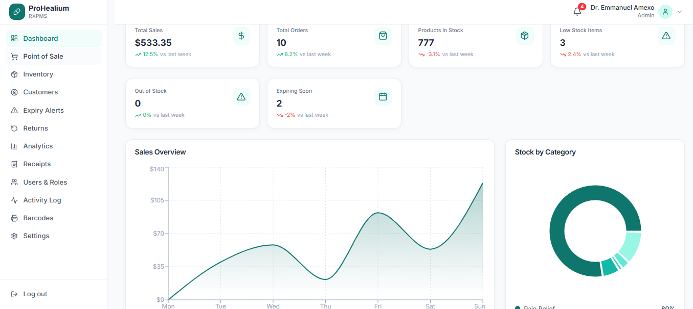
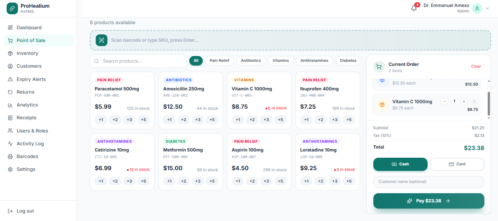
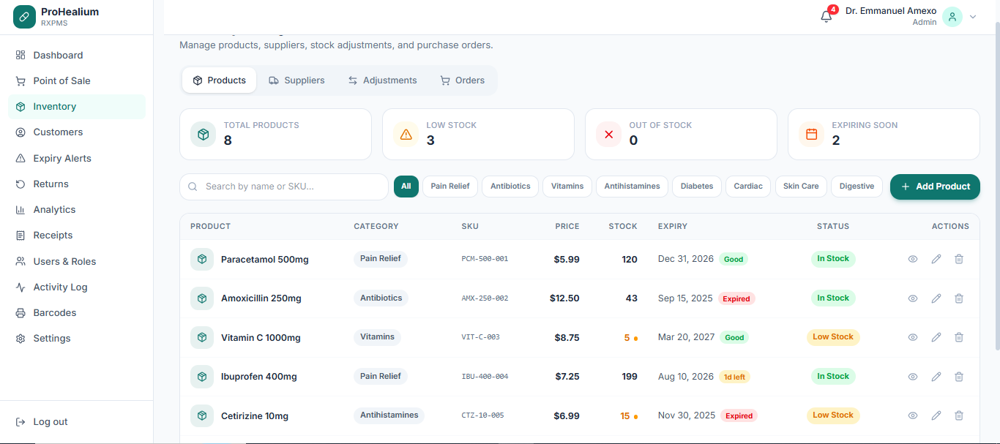
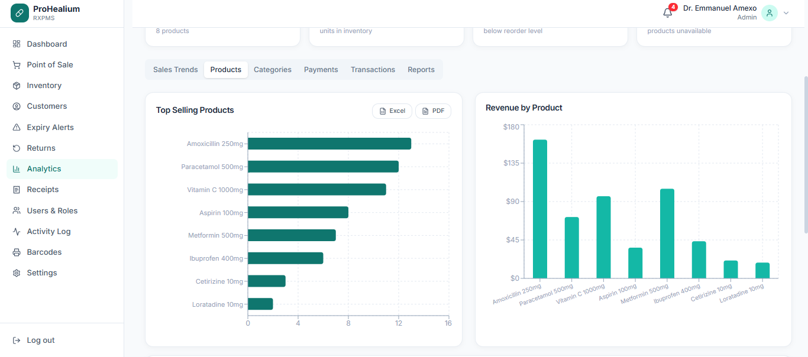
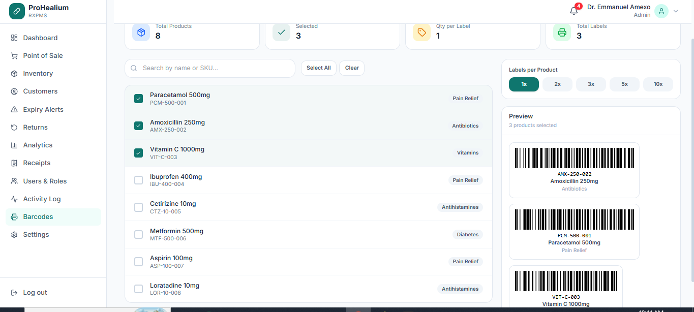
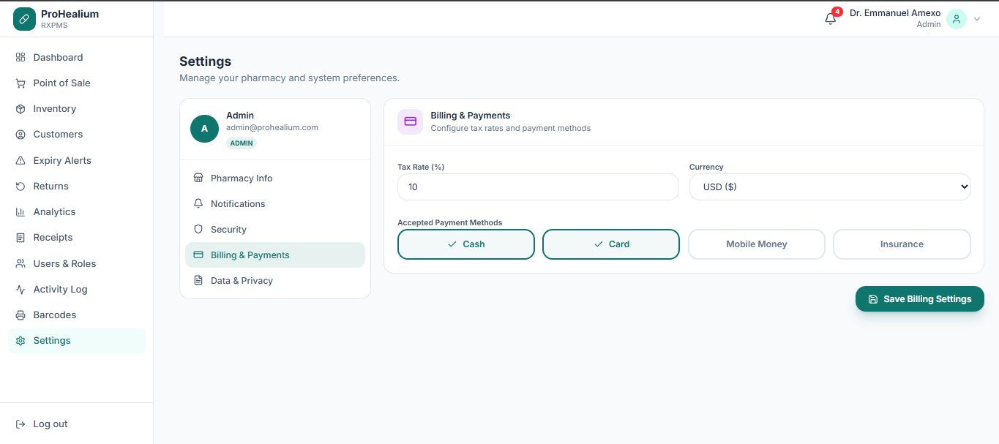
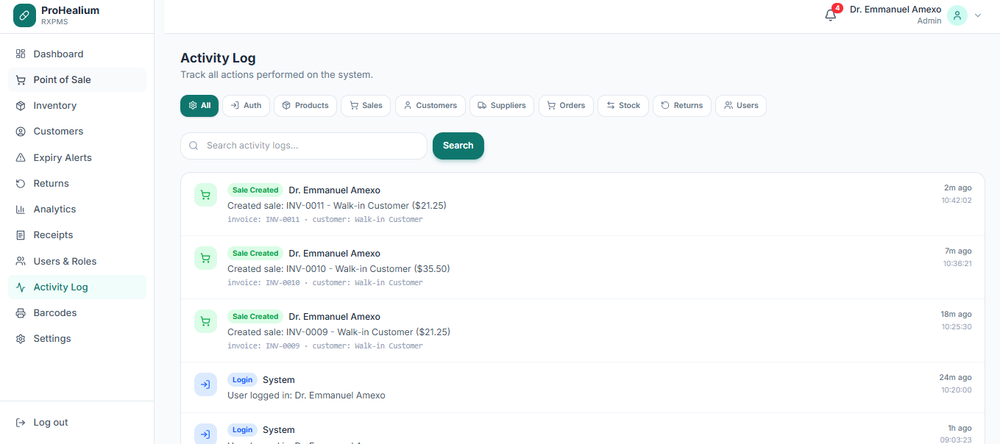

# ProHealium RxPMS

**A modern, full-featured Pharmacy Management System built with Laravel 12 and React 19.**

ProHealium RxPMS streamlines pharmacy operations — from point-of-sale and inventory management to expiry tracking, customer loyalty, and financial analytics. Designed for small to medium pharmacies, it supports offline-first POS with automatic sync, role-based access, and real-time notifications.



---

## Features

### Core Modules

| Module | Description |
|--------|-------------|
| **Dashboard** | Real-time stats, sales overview charts, stock by category, low stock & expiry alerts |
| **Point of Sale (POS)** | Offline-first cart, barcode scanning, quick-add buttons, instant checkout, digital receipts |
| **Inventory** | Products, suppliers, stock adjustments, purchase orders — all with pagination & filters |
| **Customers** | Customer profiles, loyalty points, purchase history, medical info |
| **Expiry Alerts** | Urgency-based alerts with color-coded severity and filtering |
| **Returns** | Process sale returns with item selection and refund tracking |
| **Analytics** | Sales trends, revenue breakdown, top products, category performance |
| **Receipts** | Digital receipt history with search, view, and reprint |
| **Barcodes** | Generate CODE128 barcodes with real-time preview and bulk print |
| **Users & Roles** | Role-based access (Admin, Pharmacist, Cashier) with CRUD |
| **Activity Log** | Full audit trail with category filters and pagination |
| **Settings** | Pharmacy info, notifications, security, billing, data management |

### Technical Highlights

- **Offline-First POS** — Works without internet; syncs pending sales when back online
- **Real Barcode Generation** — Uses JsBarcode for actual CODE128 barcodes
- **Digital Receipts** — Saved to localStorage, printed via thermal printer layout (80mm)
- **Sanctum Auth** — Token-based authentication with auto-refresh
- **Real-time Notifications** — Low stock & expiry alerts auto-generated every 5 minutes
- **Responsive Design** — Mobile-friendly sidebar with collapsible menu

---

## Screenshots

### Point of Sale


### Inventory Management


### Analytics


### Barcode Generator


### Invoice & Receipt


### Settings


### Activity Log


---

## Tech Stack

### Backend
- **Framework:** Laravel 12
- **Language:** PHP 8.2+
- **Database:** SQLite (dev) / MySQL (prod)
- **Auth:** Laravel Sanctum (token-based)
- **API:** RESTful JSON API

### Frontend
- **Framework:** React 19
- **Build Tool:** Vite 8
- **State:** Zustand
- **Styling:** Tailwind CSS 4
- **Charts:** Recharts
- **Barcodes:** JsBarcode
- **HTTP Client:** Axios

---

## Getting Started

### Prerequisites

- PHP 8.2+
- Composer
- Node.js 18+
- npm or yarn

### Backend Setup

```bash
# Navigate to server directory
cd server

# Install dependencies
composer install

# Copy environment file
cp .env.example .env

# Generate application key
php artisan key:generate

# Run migrations and seed database
php artisan migrate --seed

# Start the development server
php artisan serve
```

The API will be available at `http://localhost:8000`

### Frontend Setup

```bash
# Navigate to frontend directory
cd rxpms

# Install dependencies
npm install

# Start the development server
npm run dev
```

The app will be available at `http://localhost:5173`

### Default Login

| Field | Value |
|-------|-------|
| Email | `admin@prohealium.com` |
| Password | `password` |

---

## Project Structure

```
├── server/                    # Laravel Backend
│   ├── app/
│   │   ├── Http/Controllers/  # API Controllers
│   │   ├── Models/            # Eloquent Models
│   │   └── Traits/            # LogsActivity trait
│   ├── database/
│   │   └── migrations/        # Database migrations
│   └── routes/
│       └── api.php            # API routes (62 endpoints)
│
├── rxpms/                     # React Frontend
│   ├── src/
│   │   ├── components/
│   │   │   ├── layout/        # Sidebar, Topbar, Layout
│   │   │   ├── pos/           # Receipt component
│   │   │   └── ui/            # Reusable UI components
│   │   ├── pages/             # 15 page components
│   │   ├── store/             # Zustand state management
│   │   ├── lib/               # API client, utilities
│   │   └── assets/            # Static assets
│   └── screen/                # Application screenshots
```

---

## API Endpoints

### Authentication
| Method | Endpoint | Description |
|--------|----------|-------------|
| POST | `/api/login` | Login and get token |
| POST | `/api/logout` | Logout and revoke token |
| GET | `/api/user` | Get authenticated user |

### Products
| Method | Endpoint | Description |
|--------|----------|-------------|
| GET | `/api/products` | List all products |
| POST | `/api/products` | Create a product |
| PUT | `/api/products/{id}` | Update a product |
| DELETE | `/api/products/{id}` | Delete a product |

### Sales
| Method | Endpoint | Description |
|--------|----------|-------------|
| GET | `/api/sales` | List all sales |
| POST | `/api/sales` | Create a sale |
| PUT | `/api/sales/{id}` | Update a sale |
| DELETE | `/api/sales/{id}` | Delete a sale |

### Customers
| Method | Endpoint | Description |
|--------|----------|-------------|
| GET | `/api/customers` | List all customers |
| POST | `/api/customers` | Create a customer |
| PUT | `/api/customers/{id}` | Update a customer |
| DELETE | `/api/customers/{id}` | Delete a customer |

### Notifications
| Method | Endpoint | Description |
|--------|----------|-------------|
| GET | `/api/notifications` | List notifications |
| PATCH | `/api/notifications/{id}/read` | Mark as read |
| POST | `/api/notifications/read-all` | Mark all as read |
| POST | `/api/notifications/check-alerts` | Generate alerts |

### Settings
| Method | Endpoint | Description |
|--------|----------|-------------|
| GET | `/api/settings` | Get all settings |
| PUT | `/api/settings` | Update settings |

> Full API documentation available in `server/routes/api.php`

---

## Key Features in Detail

### Offline-First POS
The POS works completely offline. Products are cached in localStorage, the cart persists across sessions, and completed sales are queued for sync when connectivity returns.

### Real-Time Notifications
The system automatically checks for:
- **Low Stock** — Products at or below reorder level
- **Expiring Products** — Items expiring within 30 days

Alerts are generated on page load and refreshed every 5 minutes.

### Digital Receipts
Completed sales generate digital receipts that are:
- Saved to localStorage instantly (no blocking)
- Printed via a new browser window (80mm thermal layout)
- Synced to the API in the background
- Viewable and re printable from the Receipts page

### Role-Based Access
Three roles with different permissions:
- **Admin** — Full access to all modules
- **Pharmacist** — Inventory, sales, customers
- **Cashier** — POS and receipts only

---

## Contributing

Contributions are welcome! Please follow these steps:

1. **Fork the repository**
2. **Create a feature branch**
   ```bash
   git checkout -b feature/your-feature-name
   ```
3. **Make your changes**
4. **Commit with a clear message**
   ```bash
   git commit -m "Add: new feature description"
   ```
5. **Push to your fork**
   ```bash
   git push origin feature/your-feature-name
   ```
6. **Open a Pull Request**

### Commit Convention

Use prefixes for commit messages:
- `Add:` — New features
- `Fix:` — Bug fixes
- `Update:` — Improvements to existing features
- `Remove:` — Removing code or features
- `Refactor:` — Code restructuring without behavior change

---

## License

This project is open source and available under the [MIT License](LICENSE).

---

## Author

**ROGASIAN HAJI**

- Email: rogashianmvungi@gmail.com
- GitHub: [Your GitHub Profile](https://github.com/mvungi113)

---

## Support

If you find this project helpful, please give it a ⭐ on GitHub!

For issues or questions, open an issue on the GitHub repository or contact the author directly.
